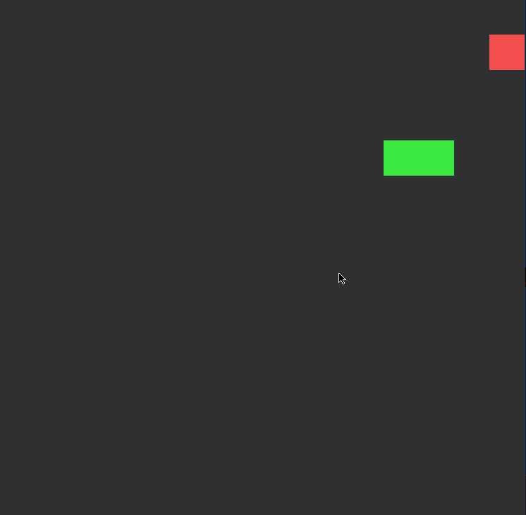

# *Snake Game Clone*

**Snake Game Clone** - Built a clone of the popular, classic game Snake using PyGame. Currently a very rough version is playable!

## Technologies

* Language: Python
* Libraries: PyGame(https://www.pygame.org/wiki/GettingStarted), unittest

## User Stories

The following **required** functionality is completed:

* [x] User can **run the game, opening a new window** to play.
* [x] User can **move the Snake up, down, left, right.**
* [x] When users **eat the red squares (apples) the snake will grow**

The following **additional** features are implemented:

* [ ] Create a **game menu allowing users to view high scores and game options.**
* [ ] Snake **length counter** in the bottom-left corner
* [ ] Play sound once the snake **eats, dies, and at the start of the game**

The following are **potential** features for future iterations:

* [ ] Deep learning AI that tries to beat the game.
* [ ] Animations for snake, end game, and game menu.

## How to play

```bash
pip install pygame

py SnakeGame.py
```

## Video Walkthrough

Here's a walkthrough of implemented user stories:



GIF created with [LiceCap](http://www.cockos.com/licecap/).

## Notes

 * Thoughout much of my developement, I used **unittest** to test the game logic and movement options of the snake.
 * This is my second time using PyGame to create a game, and overall I had an amazing time!
 * Looking to learn more about creating smart AI to hopefully win the game.
